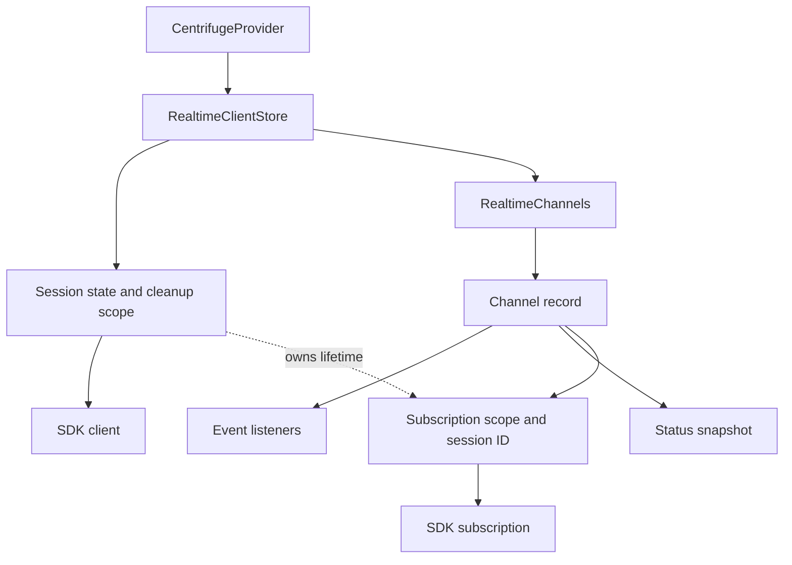
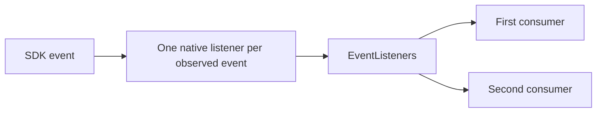

# Runtime architecture

`RealtimeClientStore` owns the session and native client. `RealtimeChannels` owns channel registrations and shared subscriptions. The provider passes an observation API to React; the ownership classes are not package exports.

## Ownership

A channel record holds its name, listeners, status, consumer IDs, and current attachment. The SDK subscription stays local to setup and cleanup. Logical registrations survive session replacement; their native subscriptions do not.

Event consumers and status observers have separate sets of registration IDs. Event consumers create demand for a native subscription. Status observers retain the channel record without opening a subscription. Each cleanup removes its own registration, so duplicate callbacks remain independent.

## Starting a session

The provider calls `store.session.set(configuration)` in an effect and returns its cleanup. Changing the public session ID or disabling the session runs that cleanup.

Internally, `session` exposes `get`, `set`, and `subscribe`. Its stored value is inactive, preparing with `client: null`, or active with a client. `get()` returns only an active session.

`set()` performs these steps:

1. Reserve a new scope and release the previous session.
2. Read the initial configuration and create the SDK client.
3. Register client cleanup, bind event listeners, and expose the active session.
4. Attach channels with existing demand.
5. Connect the client.

Configuration getters, SDK callbacks, and observer cleanup can synchronously replace the session. Setup checks its scope after those calls. An ended setup cannot continue, and an older cleanup cannot clear a newer session.

If setup fails, its scope releases acquired resources. The store remains inactive because the previous session has already ended.

## Sharing a subscription

| Operation           | Implementation         | Result                                                                                                                                  |
| ------------------- | ---------------------- | --------------------------------------------------------------------------------------------------------------------------------------- |
| Read a channel      | `RealtimeChannels.get` | Return observation methods without creating resources.                                                                                  |
| Register a consumer | `#registerConsumer`    | Add a unique registration and its callback, then check subscription demand.                                                             |
| Check demand        | `#subscribe`           | Require an active session and event consumers; reuse an attachment for that session.                                                    |
| Attach              | `#attach`              | Reserve the channel, read options, create the native subscription, bind events, and subscribe.                                          |
| Release             | Returned cleanup       | Remove the registration; release the native subscription after the last event consumer, and the channel record after the last consumer. |

Attachment is reserved before reading application options, so a nested registration cannot create a second subscription. Its scope belongs to the session scope. Ending the session therefore removes native subscriptions even when React consumers remain mounted.

Native removal completes before the attachment is cleared and `detached` status is published. A status observer can then request the same channel again without colliding with the previous SDK subscription.

## Delivering events

`EventListeners` forwards original SDK contexts in registration order. It keeps consumer registrations separate from the native source, allowing the same listeners to follow a replacement client or subscription.

Dispatch snapshots membership. Removed listeners are skipped; new listeners wait for the next event. Ending or replacing the source stops its remaining delivery. Synchronous exceptions and rejected callback promises are reported outside SDK dispatch so other consumers can continue.

Channel state and error handlers update the status snapshot before application handlers run. Events are not replayed. Hooks read current values from snapshots instead.

A temporary connection loss keeps the same client and subscriptions. The SDK owns reconnects, recovery positions, and replay. The library does not buffer publications.

## Cleanup and observation

`ResourceScope` collects synchronous cleanup functions. Disposal is idempotent, runs in reverse order, and attempts every cleanup even if one fails. `setup` rolls back acquired resources on failure. `adopt` connects a child lifetime to its parent.

`ValueStore` exposes `get`, `set`, and `subscribe`. Observation contracts expose only `get` and `subscribe`; subscription reports changes without an initial call. A nested update supersedes the older notification pass, so later listeners see the latest snapshot once.

The React-facing API contains:

- `client`: the current native client, change notifications, and native events.
- `connection`: the SDK connection state, or `disconnected` while inactive.
- `channels.get(name)`: channel events and a status snapshot.

`useObservableValue` connects snapshots to React through `useSyncExternalStore`. It adds a separate callback subscription only when `onChange` exists. `useEffectEvent` keeps callbacks current without resubscribing on every render.

`useCentrifuge()` returns `Centrifuge | null`. Connection loss preserves client identity; `useConnectionState()` observes those state changes.

## Configuration timing

`ConfigurationSource.get()` reads the provider's latest configuration. Transport and client options are captured during session creation. Subscription options are captured during attachment. Token and data callbacks read the latest configuration each time the SDK requests them.

Whether a credential callback exists is fixed when its native resource is created. `createScopedCallback` rejects calls and results from ended lifetimes; it does not cancel application requests already in flight.

## Verification

Adjacent runtime tests cover ownership, nested callbacks, rollback, event delivery, credential lifetimes, StrictMode, SSR, and hydration. Type contracts check payload inference and event/channel matching. Browser tests exercise the public API against a real Centrifugo server in Chromium, Firefox, and WebKit, including authentication, recovery, and repeated cleanup.

Run `pnpm --filter react-centrifugo test:unit` for runtime tests, `pnpm test:browser` for browser integration, or `pnpm check:release` for the complete release checks.
